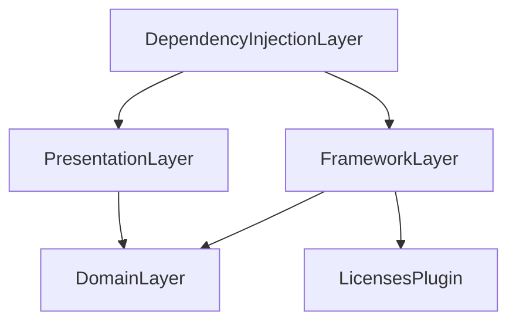

[English](./README.md) | 日本語

# Framework-Independent Architecture (FIA)

## Overview

Framework-Independent Architecture (FIA) とは、Swift でのアプリ開発のための新たに提案されるアーキテクチャです。
このアーキテクチャは Swift Package Manager を用いたマルチモジュール、マルチプロジェクト構成を取り入れ、[Clean Architecture](https://blog.cleancoder.com/uncle-bob/2011/11/22/Clean-Architecture.html) の設計原則に基づいています。

FIA の主な目的は、Clean Architecture が提供する独立性やテスタビリティといったメリットを享受すると同時に、Xcode のビルド時間の短縮を実現することにあります。

このアーキテクチャは、アプリケーションのエントリーポイントにおける依存性の注入を利用して、プレゼンテーション層だけでなくアプリケーション層にもクリーンな領域を提供します。

このような設計により、フレームワーク層に依存しない高速なアプリケーションビルドが可能となり、Xcode でのビルド時間の削減が期待できます。

以下に示す図は、FIAのアーキテクチャ全体像と依存関係の方向性を表しています。開発用のアプリケーションレイヤーまで拡張されたクリーンな領域を視覚的に表現しています。

<div align="center">

</div>

また、下図の円形のアーキテクチャは、FIA における依存関係が内向きであることを示しており、各レイヤー間の明確な境界と独立性を保っています。

<div align="center">

</div>

Framework-Independent Architecture (FIA) における "Framework" は図の "Framework Layer" を指し、Clean Architecture の最も外側のレイヤーに相当します。このレイヤーは、データアクセス層 (Data Access Layer) やインフラストラクチャ層 (Infrastructure Layer) とも呼ばれ、外部フレームワークやデータベース、ネットワーク通信などの詳細に依存する部分です。FIA ではこのレイヤーを非クリーン領域として位置づけ、開発用のアプリケーションレイヤーをクリーンに保ちつつ、本番環境のアプリケーションレイヤーのみが非クリーン領域に依存する構造を採用しています。このアプローチは、開発中のアプリケーションビルドの時間短縮を目指すものです。

## Swift Package Manager による FIA の実現

Swift Package Manager の登場によって、[isowords](https://github.com/pointfreeco/isowords) に見られるように、アプリケーションをマルチモジュールやマルチプロジェクト構成へ簡単に適用できるようになりました。

Swift Package Manager におけるモジュールの分割は通常、機能に応じて行われますが、FIA では Clean Architecture の設計原則に基づいて、各レイヤーごとにモジュールを分割する手法を採用しています。

また、Package.swift での依存関係の記述を通じて、Swift Package Manager はモジュール間の依存方向の管理を容易に行うことができます。
この点で、依存関係の方向性を重視する Clean Architecture との相性が良く、Swift Package Manager は Clean Architecture を実装するのに適しています。

さらに、FIA ではアプリケーションのエントリーポイントで依存性を注入することにより、適切な DI コンテナを選択することが可能です。
これにより、マルチプロジェクト構成を活用して、フレームワーク層に依存しないモックの DI コンテナを使用する開発用プロジェクトと、フレームワーク層に依存する実際の DI コンテナを使用する本番用プロジェクトをそれぞれ設定できます。

開発用のプロジェクトでは、Firebase SDK を一例とするようなビルド時間が長い外部ライブラリに依存しないことで、アプリケーションのビルド時間を大幅に短縮することができます。
この効果は、Xcode Previews のビルド速度の向上にも寄与します。

## Example Projects

以下のリンク先のリポジトリには、実際のプロジェクトにFIAのコンセプトを適用したサンプルコードが含まれています。これらの例は、FIA の設計原則をよりよく理解し、自身のプロジェクトに適用するのに役立ちます。

- [framework-independent-architecture/FIASmaple](https://github.com/suguruTakahashi-1234/framework-independent-architecture/tree/main/FIASmaple) (this repository)
- [FIA Practical Sample](https://github.com/suguruTakahashi-1234/fia-practical-sample.git)

> [!NOTE]
> FIA のアーキテクチャを採用したさらなるサンプルコードを募集しています。自身のプロジェクトで FIA を採用した場合、ぜひリポジトリのリンクを共有してください。共有されたプロジェクトは、このセクションで紹介します。

## Architecture Detail

FIA の実装における詳細なアーキテクチャは以下の図に示します。

<div align="center">

</div>

この図に示されている構成はあくまでも一例に過ぎず、プロジェクトの要件に応じてカスタマイズが可能です。また、実際にこれから紹介するコードは、このリポジトリのコードを一部改変したものですが、基本的な構成は同じです。

## Sample App

以下はこの章で紹介するサンプルコードを使って作成されたアプリケーションのデモンストレーションです。このアプリは、ライセンス情報を表示するシンプルな View を提供します。

<div align="center">

</div>

### Sample Code

<details><summary>Package.swift</summary>

#### Package.swift

```swift
let package = Package(
    // ... omitted ...
    dependencies: [
        // sample third party library
        .package(url: "https://github.com/maiyama18/LicensesPlugin", from: "0.1.6"),
    ],
    targets: [
        .target(
            name: "DependencyInjectionLayer",
            dependencies: ["FrameworkLayer", "PresentationLayer"]
        ),
        .target(
            name: "DomainLayer"
        ),
        .target(
            name: "FrameworkLayer",
            dependencies: ["DomainLayer"],
            plugins: [.plugin(name: "LicensesPlugin", package: "LicensesPlugin")]
        ),
        .target(
            name: "PresentationLayer",
            dependencies: ["DomainLayer"]
        )
    ]
)
```

#### Dependency Diagram



</details>

<details><summary>Domain layer</summary>

#### Entity

```swift
public struct License: Identifiable, Equatable {
    public let id: String
    public let name: String
    public let body: String
    
    public init(id: String, name: String, body: String) {
        self.id = id
        self.name = name
        self.body = body
    }
}
```

#### Driver Protocol

```swift
public protocol LicenseDriverProtocol {
    func getLicenses() -> [License]
}
```

</details>

<details><summary>Presentation layer</summary>

#### View

```swift
public struct LicenseListView<DIContainer: DIContainerDependency>: View {
    private let diContainer: DIContainer
    @State private var presenter: LicenseListPresenter<DIContainer>

    public init(diContainer: DIContainer) {
        self.diContainer = diContainer
        presenter = LicenseListPresenter(diContainer: diContainer)
    }
    
    public var body: some View {
        List {
            ForEach(presenter.licenses) { license in
                Button {
                    presenter.onTapLicense(license)
                } label: {
                    Text(license.name)
                }
            }
        }
        .navigationTitle("Licenses")
        .sheet(item: $presenter.selectedLicense, content: { license in
            NavigationStack {
                ScrollView {
                    Text(license.body).padding()
                }
                .navigationTitle(license.name)
            }
        })
        .onAppear {
            presenter.onAppear()
        }
    }
}
```

#### Presenter Dependency

```swift
public protocol LicenseListPresenterDependency {
    associatedtype LicenseDriverProtocolAssocType: LicenseDriverProtocol

    var licenseDriver: LicenseDriverProtocolAssocType { get }
}
```

#### Presenter

```swift
@Observable
final class LicenseListPresenter<DIContainer: LicenseListPresenterDependency> {
    private(set) var licenses: [License] = []
    var selectedLicense: License?
    
    private let diContainer: DIContainer
    
    init(diContainer: DIContainer) {
        self.diContainer = diContainer
    }

    func onAppear() {
        licenses = diContainer.licenseDriver.getLicenses()
    }

    func onTapLicense(_ license: License) {
        selectedLicense = license
    }
}
```

#### DI Container Dependency

```swift
public protocol DIContainerDependency: LicenseListPresenterDependency {}
```

#### Mock DI Container

```swift
public final class MockDIContainer<LicenseDriver: LicenseDriverProtocol>: DIContainerDependency {
    public let licenseDriver: LicenseDriver
    
    public init(licenseDriver: LicenseDriver = MockLicenseDriver(getLicenses: [
        License(id: UUID().uuidString, name: "Sample License 1", body: "Sample License Body 1"),
        License(id: UUID().uuidString, name: "Sample License 2", body: "Sample License Body 2"),
        License(id: UUID().uuidString, name: "Sample License 3", body: "Sample License Body 3"),
    ])) {
        self.licenseDriver = licenseDriver
    }
}

public final class MockLicenseDriver: LicenseDriverProtocol {
    private let _getLicenses: [License]
    
    public init(getLicenses: [License] = []) {
        self._getLicenses = getLicenses
    }

    public func getLicenses() -> [License] {
        return _getLicenses
    }
}
```

※ UseCase, Interactor は Presenter での複雑な処理をまとめる用途で用いられます。今回のケースでは UseCase, Interactor は採用していないため、[こちら](https://github.com/suguruTakahashi-1234/framework-independent-architecture)のより実践的なサンプルプロジェクトで確認してください。

</details>

<details><summary>Framework Layer</summary>

#### Driver

```swift
public class LicenseDriver: LicenseDriverProtocol {
    public init() {}
    
    public func getLicenses() -> [DomainLayer.License] {
        LicensesPlugin.licenses.map { library in
            License(from: library)
        }
    }
}

extension DomainLayer.License {
    // Convert Framework Entity to Domain Entity 
    init(from licensesPluginLicense: LicensesPlugin.License) {
        self.init(id: licensesPluginLicense.id, name: licensesPluginLicense.name, body: licensesPluginLicense.licenseText ?? "")
    }
}
```

</details>

<details><summary>DI Layer</summary>

#### DI Container

```swift
public final class DIContainer<LicenseDriver: LicenseDriverProtocol>: DIContainerDependency {
    public let licenseDriver: LicenseDriver
    
    public init(licenseDriver: LicenseDriver = FrameworkLayer.LicenseDriver()) {
        self.licenseDriver = licenseDriver
    }
}
```

</details>

<details><summary>Application layer (Entry Point)</summary>

#### Development App

```swift
@main
struct DevelopmentApp: App {
    var body: some Scene {
        WindowGroup {
            NavigationStack {
                // Mock DI Container
                LicenseListView(diContainer: MockDIContainer())
            }
        }
    }
}
```

#### Production App

```swift
@main
struct ProductionApp: App {
    var body: some Scene {
        WindowGroup {
            NavigationStack {
                // Actual DI Container
                LicenseListView(diContainer: DIContainer())
            }
        }
    }
}
```

</details>

## テスト

FIA は Clean Architecture をベースにしています。このアーキテクチャはサードパーティ製のライブラリや外部 API との疎通をモックに置き換える依存性の注入が可能です。
これにより、各レイヤーで独立したテストコードを記述することができます。

以下の表は、FIA で実施可能なテストの種類と、それぞれのテストがカバーする範囲を示しています。

| Test Type          | DI Container  |    Test Target:     |                   |           |            |        |
| ------------------ | :-----------: | :-----------------: | :---------------: | :-------: | :--------: | :----: |
|                    |               | View<br>Interaction | View<br>Variation | Presenter | Interactor | Driver |
| UI Test (XCUITest) | Actual / Mock |          ◎          |         ◯         |     ◯     |     ◯      | ◯ / -  |
| Xcode Previews     |     Mock      |          -          |         ◎         |     ◯     |     ◯      |   -    |
| Presenter UT       | Actual / Mock |          -          |         -         |     ◎     |     ◯      | ◯ / -  |
| Interactor UT      | Actual / Mock |          -          |         -         |     -     |     ◎      | ◯ / -  |
| Driver UT          |    Actual     |          -          |         -         |     -     |     -      |   ◎    |

※ ◎ : テスト対象、◯ : 付随的にテストされる対象

この表を参照することで、各テストの実施でカバーできるテスト対象の範囲が明確になり、テストコードの質を向上させる手助けとなります。

## FIA のメリットとデメリット

#### メリット

FIA は Clean Architecture の設計原則に基づいており、独立性、テスタビリティ、メンテナンス性、再利用性、拡張性といったメリットを提供します。特に、ビルド時間の短縮に重点を置いており、これは FIA の大きな利点となっています。

#### デメリット

一方、Clean Architecture を採用することによる実装の複雑化、学習コストの増加、オーバーエンジニアリングのリスクといったデメリットも存在します。

### FIA の実装課題とその解決策

FIA を実装する過程で遭遇する可能性のある技術的課題を以下にまとめました：

- **型の複雑性**：
  - `protocol` を用いる際に、`any` ではなく `some` を使用する場合は、型の解決が必要となり、コードが複雑になります。
- **ボイラーコードの増加**：
  - アーキテクチャの実現のために多くのボイラーコードが必要になり、たとえ単純な View を 1 つ追加する場合でも、多くのコードを実装する必要があります。
- **モックの DI コンテナの準備**：
  - 依存関係が変更されるたびにモックの DI コンテナを修正する必要があります。この作業は頻繁に発生し、多くの手間がかかります。
- **View のテスト制約**：
  - View のテストは XCUITest でのテスト実行、または Xcode Previews での目視での確認になります。
    - XCUITest は、実行時間が長く、また、複数のテストケースの作成や変更があった際のメンテナンス性が低いです。
    - Xcode Previews では、スナップショットテストが標準機能として提供されていないため、目視での確認が必要であり、問題があっても自動的には検出されません。

これらの問題に対処するためには [Sourcery](https://github.com/krzysztofzablocki/Sourcery)、[Mockolo](https://github.com/uber/mockolo)、[PreviewSnapshots](https://github.com/doordash-oss/swiftui-preview-snapshots) といったライブラリが有効です。それらのライブラリを採用した具体的な実装例については、[こちらの FIA のサンプルリポジトリ](https://github.com/suguruTakahashi-1234/fia-practical-sample.git) を参照してください。

## License

ライセンスの権利と制限については [LICENSE](./LICENSE) ファイルをご覧ください（MIT）。

## Additional Resources

#### Speaker Deck

FIA について補足する日本語の Speaker Deck スライドを以下で紹介しています。興味があれば、ぜひ参考にしてください。

- [Framework-Independent Architecture (FIA) - Speaker Deck](https://speakerdeck.com/sugurutakahashi/framework-independent-architecture-fia-clean-architecture-de-ios-apuriwobao-su-debirudosuru)

#### YouTube

- [【Swift】【クリーンアーキテクチャ】Clean Architecture で iOS アプリを爆速でビルドする方法 Framework-Independent Architecture (FIA)](https://www.youtube.com/watch?v=5blwYSQcL2E)

## Contact

ご質問やコラボレーションについては、[](https://twitter.com/ikuraikuraaaaaa)
 または GitHub の [Issue](https://github.com/suguruTakahashi-1234/framework-independent-architecture/issues) までお気軽にご連絡ください。
