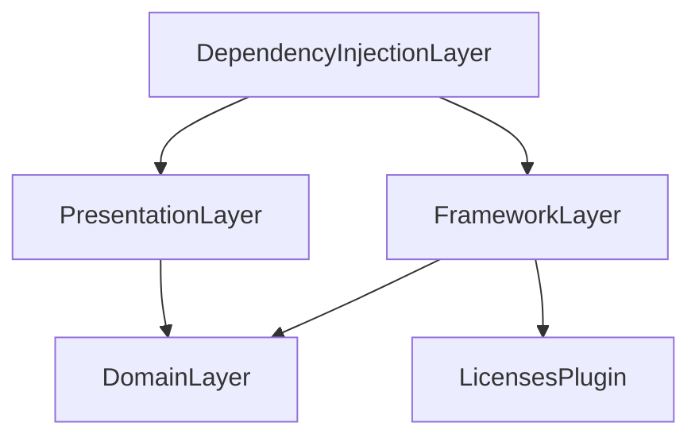
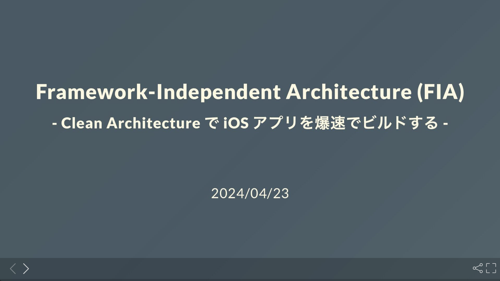

English | [日本語](./README.ja.md)

# Framework-Independent Architecture (FIA)

## Overview

The Framework-Independent Architecture (FIA) is a newly proposed architecture for Swift app development.
This architecture adopts a multi-module, multi-project structure using the Swift Package Manager and is based on the design principles of the Clean Architecture.

The main goal of FIA is to reduce Xcode build time while enjoying the benefits of independence and testability that the Clean Architecture provides.

This architecture uses dependency injection at the application entry point to provide a clean area not only at the presentation layer, but also at the application layer.

This design enables fast application builds independent of the framework layer, aiming to reduce build time significantly.

The diagram below shows the overall architecture of the FIA and the direction of dependencies. It visually represents a clean area extended to the application layer for development.

<div align="center">

</div>

The circular architecture in the figure below also illustrates the inward-looking nature of the dependencies in FIA, maintaining clear boundaries and independence among the layers.

<div align="center">

</div>

The "Framework" in the Framework-Independent Architecture (FIA) refers to the "Framework Layer" in the figure and corresponds to the outermost layer of the Clean Architecture. This layer is also called the Data Access Layer or Infrastructure Layer and depends on details such as external frameworks, databases, network communications, etc. In FIA, this layer is positioned as a non-clean area. FIA positions this layer as a non-clean area and adopts a structure where the development application layer is kept clean, while only the production application layer depends on the non-clean area. This approach aims to reduce application build time during development.

## Swift Package Manager enables FIA

With the advent of Swift Package Manager, applications can now be easily adapted to multi-module and multi-project configurations, as seen in [isowords](https://github.com/pointfreeco/isowords).

While module partitioning in the Swift Package Manager is usually done on a feature-by-feature basis, FIA uses the Clean Architecture design principles to partition modules by layer.

Also, through the description of dependencies in Package.swift, Swift Package Manager can easily manage the dependency direction between modules.
In this respect, Swift Package Manager is a good match for the Clean Architecture, which emphasizes the directionality of dependencies, making Swift Package Manager suitable for implementing the Clean Architecture.

In addition, FIA allows the selection of the appropriate DI container by injecting dependencies at the entry point of the application.
This allows you to take advantage of multi-project configurations to set up a development project using a mock DI container that is independent of the framework layer, and a production project using the actual DI container that depends on the framework layer.

Development projects can significantly reduce application build times by not relying on external libraries with long build times, such as the Firebase SDK as an example.
This effect also contributes to the build speed of Xcode Previews.

## Example Projects

The following links are repositories containing sample code that apply FIA concepts to real projects. These examples will help you better understand and apply FIA design principles to your own projects.

- [framework-independent-architecture/FIASample](https://github.com/suguruTakahashi-1234/framework-independent-architecture/tree/main/FIASample) (this repository)
- [FIA Practical Sample](https://github.com/suguruTakahashi-1234/fia-practical-sample.git)

> [!NOTE]
> We are looking for more sample code that employs the FIA architecture. If you have adopted FIA in your own project, please share the repository link. Shared projects will be featured in this section.

## Architecture Detail

The detailed architecture of the FIA implementation is shown in the figure below.

<div align="center">

</div>

The configuration shown in this figure is only an example and can be customized according to the requirements of your project. Also, the actual code we are about to show you is a partially modified version of the code in this repository, but the basic structure is the same.

## Sample App

The following is a demonstration of an application created by the sample code presented in this chapter. This application provides a simple View that displays license information.

<div align="center">

</div>

### Sample Code

<details><summary>Package.swift</summary>

#### Package.swift

```swift
let package = Package(
    // ... omitted ...
    dependencies: [
        // sample third party library
        .package(url: "https://github.com/maiyama18/LicensesPlugin", from: "0.1.6"),
    ],
    targets: [
        .target(
            name: "DependencyInjectionLayer",
            dependencies: ["FrameworkLayer", "PresentationLayer"]
        ),
        .target(
            name: "DomainLayer"
        ),
        .target(
            name: "FrameworkLayer",
            dependencies: ["DomainLayer"],
            plugins: [.plugin(name: "LicensesPlugin", package: "LicensesPlugin")]
        ),
        .target(
            name: "PresentationLayer",
            dependencies: ["DomainLayer"]
        )
    ]
)
```

#### Dependency Diagram



</details>

<details><summary>Domain layer</summary>

#### Entity

```swift
public struct License: Identifiable, Equatable {
    public let id: String
    public let name: String
    public let body: String
    
    public init(id: String, name: String, body: String) {
        self.id = id
        self.name = name
        self.body = body
    }
}
```

#### Driver Protocol

```swift
public protocol LicenseDriverProtocol {
    func getLicenses() -> [License]
}
```

</details>

<details><summary>Presentation layer</summary>

#### View

```swift
public struct LicenseListView<DIContainer: DIContainerDependency>: View {
    private let diContainer: DIContainer
    @State private var presenter: LicenseListPresenter<DIContainer>

    public init(diContainer: DIContainer) {
        self.diContainer = diContainer
        presenter = LicenseListPresenter(diContainer: diContainer)
    }
    
    public var body: some View {
        List {
            ForEach(presenter.licenses) { license in
                Button {
                    presenter.onTapLicense(license)
                } label: {
                    Text(license.name)
                }
            }
        }
        .navigationTitle("Licenses")
        .sheet(item: $presenter.selectedLicense, content: { license in
            NavigationStack {
                ScrollView {
                    Text(license.body).padding()
                }
                .navigationTitle(license.name)
            }
        })
        .onAppear {
            presenter.onAppear()
        }
    }
}
```

#### Presenter Dependency

```swift
public protocol LicenseListPresenterDependency {
    associatedtype LicenseDriverProtocolAssocType: LicenseDriverProtocol

    var licenseDriver: LicenseDriverProtocolAssocType { get }
}
```

#### Presenter

```swift
@Observable
final class LicenseListPresenter<DIContainer: LicenseListPresenterDependency> {
    private(set) var licenses: [License] = []
    var selectedLicense: License?
    
    private let diContainer: DIContainer
    
    init(diContainer: DIContainer) {
        self.diContainer = diContainer
    }

    func onAppear() {
        licenses = diContainer.licenseDriver.getLicenses()
    }

    func onTapLicense(_ license: License) {
        selectedLicense = license
    }
}
```

#### DI Container Dependency

```swift
public protocol DIContainerDependency: LicenseListPresenterDependency {}
```

#### Mock DI Container

```swift
public final class MockDIContainer<LicenseDriver: LicenseDriverProtocol>: DIContainerDependency {
    public let licenseDriver: LicenseDriver
    
    public init(licenseDriver: LicenseDriver = MockLicenseDriver(getLicenses: [
        License(id: UUID().uuidString, name: "Sample License 1", body: "Sample License Body 1"),
        License(id: UUID().uuidString, name: "Sample License 2", body: "Sample License Body 2"),
        License(id: UUID().uuidString, name: "Sample License 3", body: "Sample License Body 3"),
    ])) {
        self.licenseDriver = licenseDriver
    }
}

public final class MockLicenseDriver: LicenseDriverProtocol {
    private let _getLicenses: [License]
    
    public init(getLicenses: [License] = []) {
        self._getLicenses = getLicenses
    }

    public func getLicenses() -> [License] {
        return _getLicenses
    }
}
```

</details>

<details><summary>Framework Layer</summary>

#### Driver

```swift
public class LicenseDriver: LicenseDriverProtocol {
    public init() {}
    
    public func getLicenses() -> [DomainLayer.License] {
        LicensesPlugin.licenses.map { library in
            License(from: library)
        }
    }
}

extension DomainLayer.License {
    // Convert Framework Entity to Domain Entity 
    init(from licensesPluginLicense: LicensesPlugin.License) {
        self.init(id: licensesPluginLicense.id, name: licensesPluginLicense.name, body: licensesPluginLicense.licenseText ?? "")
    }
}
```

※ UseCase, Interactor is used to organize complex processing in Presenter. Since UseCase, Interactor is not used in this case, please refer to the more practical sample project [here](https://github.com/suguruTakahashi-1234/framework-independent-architecture).

</details>

<details><summary>DI Layer</summary>

#### DI Container

```swift
public final class DIContainer<LicenseDriver: LicenseDriverProtocol>: DIContainerDependency {
    public let licenseDriver: LicenseDriver
    
    public init(licenseDriver: LicenseDriver = FrameworkLayer.LicenseDriver()) {
        self.licenseDriver = licenseDriver
    }
}
```

</details>

<details><summary>Application layer (Entry Point)</summary>

#### Development App

```swift
@main
struct DevelopmentApp: App {
    var body: some Scene {
        WindowGroup {
            NavigationStack {
                // Mock DI Container
                LicenseListView(diContainer: MockDIContainer())
            }
        }
    }
}
```

#### Production App

```swift
@main
struct ProductionApp: App {
    var body: some Scene {
        WindowGroup {
            NavigationStack {
                // Actual DI Container
                LicenseListView(diContainer: DIContainer())
            }
        }
    }
}
```

</details>

## Testing

FIA is based on the Clean Architecture. This architecture allows for the injection of third-party libraries and dependencies that replace communication with external APIs with mocks.
This allows each layer to write independent test code.

The following table shows the types of tests that can be performed with FIA and the scope covered by each test.

| Test Type          | DI Container  |    Test Target:     |                   |           |            |        |
| ------------------ | :-----------: | :-----------------: | :---------------: | :-------: | :--------: | :----: |
|                    |               | View<br>Interaction | View<br>Variation | Presenter | Interactor | Driver |
| UI Test (XCUITest) | Actual / Mock |          ◎          |         ◯         |     ◯     |     ◯      | ◯ / -  |
| Xcode Previews     |     Mock      |          -          |         ◎         |     ◯     |     ◯      |   -    |
| Presenter UT       | Actual / Mock |          -          |         -         |     ◎     |     ◯      | ◯ / -  |
| Interactor UT      | Actual / Mock |          -          |         -         |     -     |     ◎      | ◯ / -  |
| Driver UT          |    Actual     |          -          |         -         |     -     |     -      |   ◎    |

※ ◎ : Object to be tested, ◯ : Object to be tested incidentally

By referring to this table, the scope of test objects that can be covered by each test execution becomes clear, helping to improve the quality of the test code.

## Advantages and disadvantages of FIA

#### Advantages

FIA is based on Clean Architecture design principles and offers the advantages of independence, testability, maintainability, reusability, and extensibility. Particular emphasis is placed on reducing build time, which is a major advantage of FIA.

#### Disadvantages

On the other hand, there are some disadvantages of adopting Clean Architecture, such as increased implementation complexity, higher learning cost, and risk of overengineering.

### FIA Implementation Challenges and Solutions

Technical challenges that may be encountered in the process of implementing FIA are summarized below:

- **Type complexity**:
  - When using `protocol`, the use of `some` instead of `any` requires type resolution, which increases the complexity of the code.
- **Increase boiler code**:
  - A lot of boilerplate code is needed to implement the architecture, even for a single simple View.
- **Prepare DI container for mocks**:
  - Mock DI containers must be modified each time a dependency changes. This is a frequent and time-consuming task.
- **View testing constraints**:
  - View testing can be done by running tests in XCUITest or visually in Xcode Previews.
    - XCUITest has a long execution time and is less maintainable when multiple test cases are created or modified.
    - Xcode Previews does not provide snapshot testing as a standard feature, so visual verification is required and problems are not automatically detected.

To address these issues, you can use [Sourcery](https://github.com/krzysztofzablocki/Sourcery), [Mockolo](https://github.com/uber/mockolo), [ PreviewSnapshots](https://github.com/doordash-oss/swiftui-preview-snapshots). For concrete examples of implementations employing these libraries, please refer to [this FIA sample repository](https://github.com/suguruTakahashi-1234/fia-practical-sample.git).

## License

See the [LICENSE](./LICENSE) file for license rights and limitations (MIT).

## Additional Resources

Japanese Speaker Deck slides that supplement the FIA are presented below. If you are interested, please refer to them.

<div align="center">
  <a href="https://speakerdeck.com/sugurutakahashi/framework-independent-architecture-fia-clean-architecture-de-ios-apuriwobao-su-debirudosuru">
    
  </a>
</div>

## Contact

For questions or collaboration, please contact us at [](https://twitter.com/ikuraikuraaaaaa)
 or feel free to contact us at [Issue](https://github.com/suguruTakahashi-1234/framework-independent-architecture/issues) on GitHub.
