<!-- _class : lead invert-->

## Framework-Independent Architecture (FIA)
#### - Clean Architecture で iOS アプリを爆速でビルドする -

  2024/04/23

---

<!-- paginate: true -->

## 自己紹介

- 高橋 俊
  - iOS エンジニア
  - アカウント
    - X: @ikuraikuraaaaaa
    - GitHub: @suguruTakahashi-1234
  - 技術
    - Swift, iOS, IoT

---

## 話すこと

- **Clean Architecture を使って iOS アプリを爆速でビルドする方法**
  - = Framework-Independent Architecture (FIA) の紹介
- **MV → MVP (MVVM) → Clean Architecture → FIA への リアーキテクチャの実演**

---

## 話さないこと

- Clean Architecture の詳細

---

<!-- _class : lead invert-->

# iOS アプリ開発における 現状のアーキテクチャ候補

---

## 大きくこれらの 3 パターンに分けられる

- Layered Architecture 系 (MVVM, MVP, VIPER)
  - → View と ビズネスロジック の分離
- Redux 系 (TCA, ReSwift)
  - → 単方向データフロー
- Clean Architecture 系 (VIPER)
  - → 内側方向への依存性の統一、依存性の逆転原則、関心事の分離

---

<!-- _class : lead invert-->

### iOS アプリ開発 アーキテクチャ パターン

---

<!-- _class : lead invert-->

### 今回、紹介する FIA は Clean Architecture 系 である

---

<!-- _class : lead invert-->

## Framework-Independent Architecture とは

### F = Framework Layer = Framework 層に
### I = Independent = 非依存な
### A = Architecture = アーキテクチャ

## → Framework 層に 非依存な アーキテクチャ

---

<!-- _class : lead invert-->

# Framework Layer ?

---

## Framework Layer ?

- Clean Architecture の 最も外側の層
- Data Access Layer や Infrastructure Layer とも 呼ばれる
- iOS アプリ開発においては 3rd パーティー製 SDK や ギークな処理を扱う層

※ 一般的な用語ではない

---

## FIA を採用する目的

- **Xcode でのビルド時間の短縮**
  - テスト、Previews も対象
- Clean Architecture のメリットの享受
  - 独立性
  - テスタビリティー
  - メンテナビリティー
  - etc...

---

## FIA 概略

---

<!-- _class : lead invert-->

## Clean Architecture 円との比較

###        本質的に両者は同じことを表している

---

<!-- _class : lead invert-->

## リアーキテクチャを通して FIA での実装の実演

#### https://www.youtube.com/ (TODO: 後ほど更新)

---

<!-- _class : lead invert-->

# それぞれのアーキテクチャの特徴

---

## MV

- メリット✨
  - シンプル
- デメリット⚠️
  - ビジネスロジックのテストができない
- テスト🧪
  - 🆕 XCUITest での UI テスト
  - 🆕 Previews での View の確認

---

## MVP (MVVM) (Not Repository Pattern)

- メリット✨
  - View とビジネスロジックの分離
  - ビジネスロジックのテスト可能
- デメリット⚠️
  - Previews で View のバリエーションを増やすのが難しい
- テスト🧪
  - 🆕 Presenter (ViewModel) のビジネスロジックのテスト

---

## MVP (MVVM) + Repository Pattern

- メリット✨
  - ビジネスロジックとデータアクセスの分離
  - モックによるデータの差し替えが可能
  - データアクセスロジックのテストが可能
- デメリット⚠️
  - View→Presenter での Repository (Driver) のバケツリレーの発生
- テスト🧪
  - 🆕 Previews でのモックを使ったバリエーションテスト
  - 🆕 Repository (Driver) のデータアクセスロジックの単体テスト

---

## Clean Architecture

- メリット✨
  - Presentation 層 (View, Presenter (ViewModel)) が、　Framework 層 (Repository (Driver)) に非依存になる
    - → 3rd パーティー製ライブラリの乗換えによる影響が限定的
- デメリット⚠️
  - Domain Entity の定義の発生
- テスト🧪
  - Clean Architecture に変更しても MVP (MVVM) + Repository Pattern から追加で実施できるテストは特にない

---

## Framework-Independent Architecture (FIA)

- メリット✨
  - Framework 層に非依存なアプリ/モジュールのビルドの高速化
- デメリット⚠️
  - Application 層からの Repository (Driver) のバケツリレーの発生
    - → DI Container の導入で解決
- テスト🧪
  - Framework 層に非依存なアプリの XCUITest の高速化

---

<!-- _class : lead invert-->

## FIA で可能なテスト

| Test Type  | DI Container  |    Test Target:     |                   |           |            |        |
| ---------- | :-----------: | :-----------------: | :---------------: | :-------: | :--------: | :----: |
|            |               | View Interaction | View Variation | Presenter | Interactor | Driver |
| XCUITest   | Actual / Mock |          ◎          |         ◯         |     ◯     |     ◯      | ◯ / -  |
| Previews   |     Mock      |          -          |         ◎         |     ◯     |     ◯      |   -    |
| Presenter  | Actual / Mock |          -          |         -         |     ◎     |     ◯      | ◯ / -  |
| Interactor | Actual / Mock |          -          |         -         |     -     |     ◎      | ◯ / -  |
| Driver     |    Actual     |          -          |         -         |     -     |     -      |   ◎    |

#### → 各テストがどの範囲をカバーするかが明確

---

## FIA の実装課題とその解決策

- protocol の any → some とする場合、型解決が複雑になる
- アーキテクチャ実現のための、多くのボイラーコードが必要
- モック用の DI Container の準備が手間になる
- View のテスト制約
  - XCUITest: 長い実行時間、低いメンテナンス性
  - Previews: 目視確認が必要、エラーが自動的には検出されない

### → Sourcery、Mockolo、PreviewSnapshots の導入

---

## FIA の実装を助けるライブラリの紹介

- [Sourcery](https://github.com/krzysztofzablocki/Sourcery)
  - 繰り返しとなるボイラーコードの自動生成
- [Mockolo](https://github.com/uber/mockolo)
  - モック用の DI Container の自動生成
  - typealias での some protocol の型解決にも対応
- [PreviewSnapshots](https://github.com/doordash-oss/swiftui-preview-snapshots)
  - Previews のコードをスナップショットテストとして転用可能

これらのライブラリを採用したリポジトリを公開:
https://github.com/suguruTakahashi-1234/fia-practical-sample

---

## まとめ

- Framework-Independent Architecture (FIA)
  - Clean Architecture をベースにしたアーキテクチャ
  - Framework 層に非依存である
- FIA 採用の目的
  - ビルド時間の短縮
  - Clean Architecture のメリットの享受
- FIA での実装
  - MVP (MVVM) からリアーキテクチャ可能である
  - [Sourcery](https://github.com/krzysztofzablocki/Sourcery) や [Mockolo](https://github.com/uber/mockolo) などの自動生成ツールが有効である

---

<!-- _class : lead invert-->

# Thank You🌸
